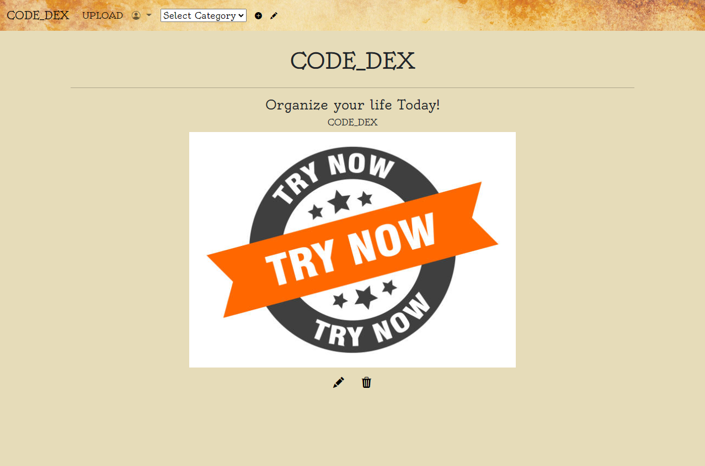
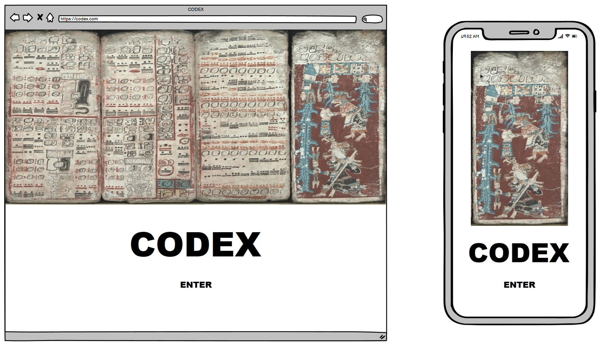
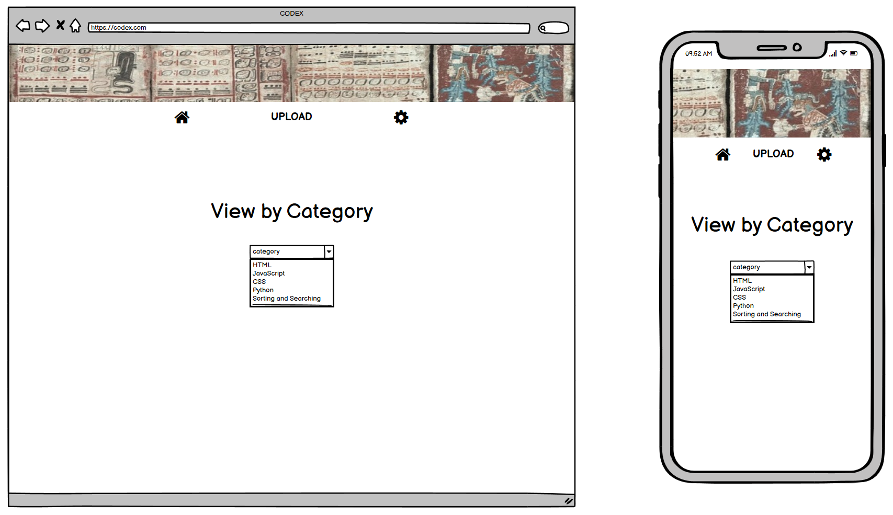
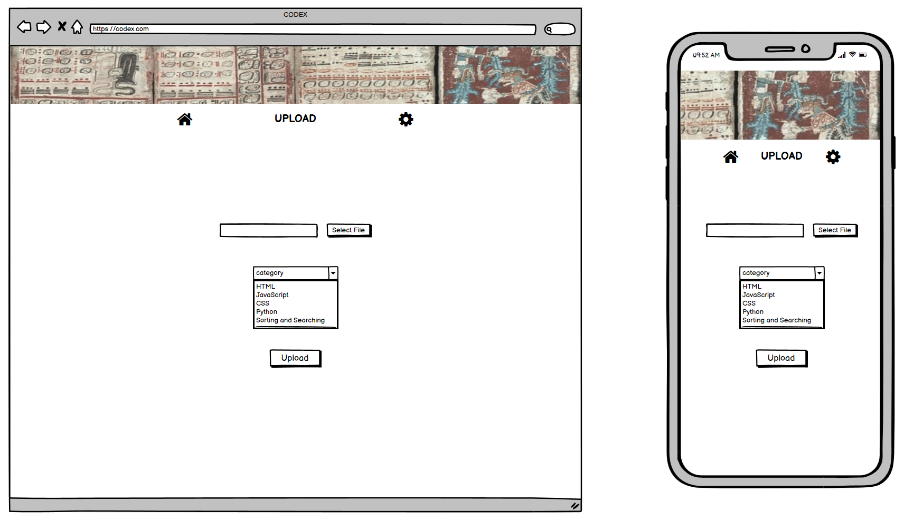
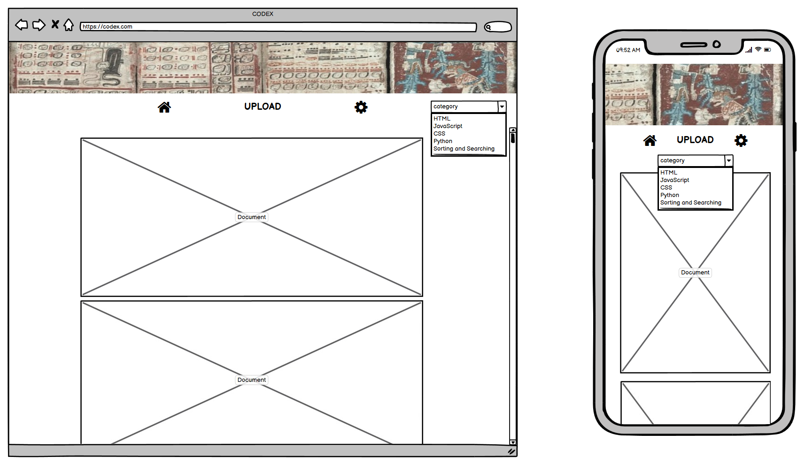
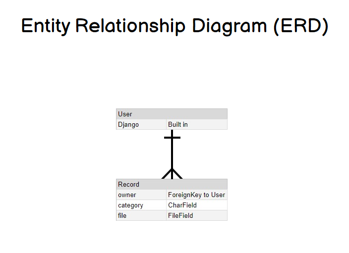

# <a href='https://codedex.herokuapp.com/'>Code_Dex</a>

### Built with the following technologies

### Features
 - Create and manage your own categories
 - Upload PDF, JPEG and PNG files
 - All content is tied to your user account so you control the category list and only you can access your uploads

## Overview and Approach

A simple app for storing and accessing reference material.  Although originally created for use as a software engineer, the platform is flexible and can be used for notes and reference material of any kind.  Create your own categories and upload PDFs or photos to them as you see fit!

As a project, this was my initial attempt at a Django full stack application.  That being the case, I kept it simple and gave myself plenty of time to to navigate the spiderweb that is Django setup and functionality.  In the end after some serious setbacks with the hosting platform (heroku) I was able to dig in and learn a lot about Django implementation.  As a React developer I initially found it cumbersome, but was delighted once I got the hang of class views and took advantage of the under-the-hood functionality that Django offers.

### Key Challenges
- Hosting on Heroku with Django was extremely tricky if I added any third party packages.  I ended up scrapping my first attempt on day 2 after spending a day trying to troubleshoot why the live site wasn't working after adding a styling package.
- File management was tricky and I spent a fair amount of time learning how to integrate AWS S3 buckets with Django and Heroku.
- As mentioned above, Django itself is quite dense and it took some time to learn how to do even the basics, like handing context from a link on one page to the destination template for reverse navigation etc.

### Roadmap
- I'd like to fully overwrite the default user auth forms to make them more attractive.
- I would also like to implement the built in password reset functionality that Django offers via email reset link.
- I would like to build in compatibility for more file types such as all MS Office file extensions and .csv

## Planning

### User Stories

- As a user I want to be able to upload files so that I can reference them later
- As a user I want to be able to view files by category so that I can quickly get to the information I need
- As a user I want to be able to view only my files so that I have control over my content
- As a user I want to be able to update my profile settings so that I can change my personal details
- As a user I want to be able to edit and define categories so that I can better organize my reference material

### Wireframes

Landing Page

\
Home Screen

\
Upload Form

\
Document View

### Entity Relationship Diagram

\
